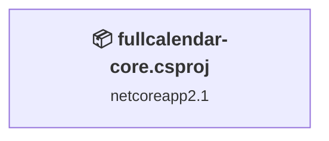
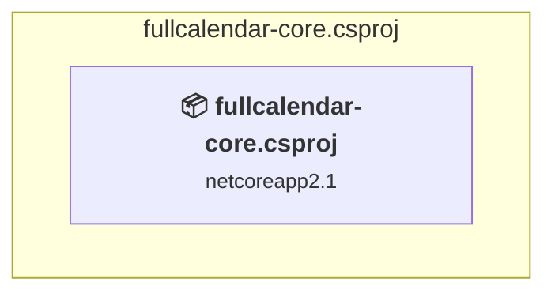

# Projects and dependencies analysis

This document provides a comprehensive overview of the projects and their dependencies in the context of upgrading to .NETCoreApp,Version=v10.0.

## Table of Contents

- [Executive Summary](#executive-Summary)
  - [Highlevel Metrics](#highlevel-metrics)
  - [Projects Compatibility](#projects-compatibility)
  - [Package Compatibility](#package-compatibility)
  - [API Compatibility](#api-compatibility)
- [Aggregate NuGet packages details](#aggregate-nuget-packages-details)
- [Top API Migration Challenges](#top-api-migration-challenges)
  - [Technologies and Features](#technologies-and-features)
  - [Most Frequent API Issues](#most-frequent-api-issues)
- [Projects Relationship Graph](#projects-relationship-graph)
- [Project Details](#project-details)

  - [fullcalendar-core\fullcalendar-core.csproj](#fullcalendar-corefullcalendar-corecsproj)

## Executive Summary

### Highlevel Metrics

| Metric | Count | Status |
| :--- | :---: | :--- |
| Total Projects | 1 | All require upgrade |
| Total NuGet Packages | 3 | All compatible |
| Total Code Files | 15 |  |
| Total Code Files with Incidents | 4 |  |
| Total Lines of Code | 560 |  |
| Total Number of Issues | 128 |  |
| Estimated LOC to modify | 125+ | at least 22.3% of codebase |

### Projects Compatibility

| Project | Target Framework | Difficulty | Package Issues | API Issues | Est. LOC Impact | Description |
| :--- | :---: | :---: | :---: | :---: | :---: | :--- |
| [fullcalendar-core\fullcalendar-core.csproj](#fullcalendar-corefullcalendar-corecsproj) | netcoreapp2.1 | 🟢 Low | 2 | 125 | 125+ | AspNetCore, Sdk Style = True |

### Package Compatibility

| Status | Count | Percentage |
| :--- | :---: | :---: |
| ✅ Compatible | 3 | 100.0% |
| ⚠️ Incompatible | 0 | 0.0% |
| 🔄 Upgrade Recommended | 0 | 0.0% |
| ***Total NuGet Packages*** | ***3*** | ***100%*** |

### API Compatibility

| Category | Count | Impact |
| :--- | :---: | :--- |
| 🔴 Binary Incompatible | 1 | High - Require code changes |
| 🟡 Source Incompatible | 123 | Medium - Needs re-compilation and potential conflicting API error fixing |
| 🔵 Behavioral change | 1 | Low - Behavioral changes that may require testing at runtime |
| ✅ Compatible | 488 |  |
| ***Total APIs Analyzed*** | ***613*** |  |

## Aggregate NuGet packages details

| Package | Current Version | Suggested Version | Projects | Description |
| :--- | :---: | :---: | :--- | :--- |
| Microsoft.AspNetCore.App |  |  | [fullcalendar-core.csproj](#fullcalendar-corefullcalendar-corecsproj) | NuGet package functionality is included with framework reference |
| Microsoft.AspNetCore.Razor.Design | 2.1.2 |  | [fullcalendar-core.csproj](#fullcalendar-corefullcalendar-corecsproj) | NuGet package functionality is included with framework reference |
| Microsoft.NETCore.App |  |  | [fullcalendar-core.csproj](#fullcalendar-corefullcalendar-corecsproj) | ✅Compatible |

## Top API Migration Challenges

### Technologies and Features

| Technology | Issues | Percentage | Migration Path |
| :--- | :---: | :---: | :--- |

### Most Frequent API Issues

| API | Count | Percentage | Category |
| :--- | :---: | :---: | :--- |
| T:System.Data.SqlClient.SqlParameterCollection | 14 | 11.2% | Source Incompatible |
| P:System.Data.SqlClient.SqlCommand.Parameters | 14 | 11.2% | Source Incompatible |
| T:System.Data.SqlClient.SqlParameter | 14 | 11.2% | Source Incompatible |
| M:System.Data.SqlClient.SqlParameterCollection.Add(System.String,System.Data.SqlDbType) | 14 | 11.2% | Source Incompatible |
| P:System.Data.SqlClient.SqlParameter.Value | 14 | 11.2% | Source Incompatible |
| T:System.Data.SqlClient.SqlConnection | 7 | 5.6% | Source Incompatible |
| P:System.Data.SqlClient.SqlDataReader.Item(System.String) | 6 | 4.8% | Source Incompatible |
| P:System.Data.SqlClient.SqlCommand.CommandType | 4 | 3.2% | Source Incompatible |
| T:System.Data.SqlClient.SqlCommand | 4 | 3.2% | Source Incompatible |
| M:System.Data.SqlClient.SqlTransaction.Rollback | 3 | 2.4% | Source Incompatible |
| M:System.Data.SqlClient.SqlTransaction.Commit | 3 | 2.4% | Source Incompatible |
| M:System.Data.SqlClient.SqlCommand.#ctor(System.String,System.Data.SqlClient.SqlConnection,System.Data.SqlClient.SqlTransaction) | 3 | 2.4% | Source Incompatible |
| T:System.Data.SqlClient.SqlTransaction | 3 | 2.4% | Source Incompatible |
| M:System.Data.SqlClient.SqlConnection.BeginTransaction | 3 | 2.4% | Source Incompatible |
| M:System.Data.SqlClient.SqlCommand.ExecuteNonQuery | 2 | 1.6% | Source Incompatible |
| T:Microsoft.AspNetCore.Mvc.CompatibilityVersion | 2 | 1.6% | Source Incompatible |
| M:System.Data.SqlClient.SqlCommand.ExecuteScalar | 1 | 0.8% | Source Incompatible |
| M:System.Data.SqlClient.SqlDataReader.Read | 1 | 0.8% | Source Incompatible |
| T:System.Data.SqlClient.SqlDataReader | 1 | 0.8% | Source Incompatible |
| M:System.Data.SqlClient.SqlCommand.ExecuteReader | 1 | 0.8% | Source Incompatible |
| M:System.Data.SqlClient.SqlCommand.#ctor(System.String,System.Data.SqlClient.SqlConnection) | 1 | 0.8% | Source Incompatible |
| M:System.Data.SqlClient.SqlConnection.Close | 1 | 0.8% | Source Incompatible |
| M:System.Data.SqlClient.SqlConnection.Open | 1 | 0.8% | Source Incompatible |
| M:System.Data.SqlClient.SqlConnection.#ctor(System.String) | 1 | 0.8% | Source Incompatible |
| T:Microsoft.AspNetCore.WebHost | 1 | 0.8% | Source Incompatible |
| T:Microsoft.AspNetCore.Hosting.IWebHost | 1 | 0.8% | Source Incompatible |
| T:Microsoft.AspNetCore.Hosting.IHostingEnvironment | 1 | 0.8% | Source Incompatible |
| M:Microsoft.AspNetCore.Builder.ExceptionHandlerExtensions.UseExceptionHandler(Microsoft.AspNetCore.Builder.IApplicationBuilder,System.String) | 1 | 0.8% | Behavioral Change |
| M:Microsoft.Extensions.DependencyInjection.OptionsConfigurationServiceCollectionExtensions.Configure''1(Microsoft.Extensions.DependencyInjection.IServiceCollection,Microsoft.Extensions.Configuration.IConfiguration) | 1 | 0.8% | Binary Incompatible |
| F:Microsoft.AspNetCore.Mvc.CompatibilityVersion.Version_2_1 | 1 | 0.8% | Source Incompatible |
| M:Microsoft.Extensions.DependencyInjection.MvcCoreMvcBuilderExtensions.SetCompatibilityVersion(Microsoft.Extensions.DependencyInjection.IMvcBuilder,Microsoft.AspNetCore.Mvc.CompatibilityVersion) | 1 | 0.8% | Source Incompatible |

## Projects Relationship Graph

Legend:
📦 SDK-style project
⚙️ Classic project

## Project Details

### fullcalendar-core\fullcalendar-core.csproj

#### Project Info

- **Current Target Framework:** netcoreapp2.1
- **Proposed Target Framework:** net10.0
- **SDK-style**: True
- **Project Kind:** AspNetCore
- **Dependencies**: 0
- **Dependants**: 0
- **Number of Files**: 24
- **Number of Files with Incidents**: 4
- **Lines of Code**: 560
- **Estimated LOC to modify**: 125+ (at least 22.3% of the project)

#### Dependency Graph

Legend:
📦 SDK-style project
⚙️ Classic project

### API Compatibility

| Category | Count | Impact |
| :--- | :---: | :--- |
| 🔴 Binary Incompatible | 1 | High - Require code changes |
| 🟡 Source Incompatible | 123 | Medium - Needs re-compilation and potential conflicting API error fixing |
| 🔵 Behavioral change | 1 | Low - Behavioral changes that may require testing at runtime |
| ✅ Compatible | 488 |  |
| ***Total APIs Analyzed*** | ***613*** |  |

