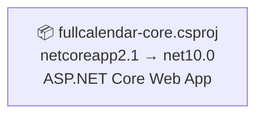

# .NET 10.0 Upgrade Plan

## Table of Contents

- [Executive Summary](#executive-summary)
- [Migration Strategy](#migration-strategy)
- [Detailed Dependency Analysis](#detailed-dependency-analysis)
- [Project-by-Project Plans](#project-by-project-plans)
  - [fullcalendar-core.csproj](#fullcalendar-corecsproj)
- [Package Update Reference](#package-update-reference)
- [Breaking Changes Catalog](#breaking-changes-catalog)
- [Testing & Validation Strategy](#testing--validation-strategy)
- [Complexity & Effort Assessment](#complexity--effort-assessment)
- [Risk Management](#risk-management)
- [Source Control Strategy](#source-control-strategy)
- [Success Criteria](#success-criteria)

---

## Executive Summary

### Scenario Description
This plan outlines the upgrade of the fullcalendar-aspnet-core solution from **.NET Core 2.1** to **.NET 10.0 (Long Term Support)**. The solution consists of a single ASP.NET Core web application that manages calendar events using SQL Server as the data store.

### Scope
- **Projects Affected**: 1 project (fullcalendar-core.csproj)
- **Current State**: .NET Core 2.1 (netcoreapp2.1)
- **Target State**: .NET 10.0 (net10.0)
- **Total Lines of Code**: 560 LOC
- **Estimated Impact**: 125+ LOC requiring modification (22.3% of codebase)

### Selected Strategy
**All-At-Once Strategy** - All changes applied in a single coordinated operation.

**Rationale**: 
- Single project with no internal dependencies
- Small codebase (560 LOC)
- Clear, straightforward upgrade path
- All packages compatible or included in framework
- No security vulnerabilities blocking progress

### Discovered Metrics
- **Total Projects**: 1
- **Dependency Depth**: 0 (standalone project)
- **Risk Level**: Low
- **NuGet Packages**: 3 (all compatible, 2 will be removed as framework-included)
- **API Issues**: 125 (primarily System.Data.SqlClient namespace migration)
- **Breaking Changes**: 1 binary incompatible, 123 source incompatible, 1 behavioral change

### Complexity Classification
**Simple Solution** - Enables fast batch upgrade approach with consolidated validation.

### Critical Issues
1. **System.Data.SqlClient Migration**: The legacy `System.Data.SqlClient` namespace (123 source incompatible APIs) must be replaced with `Microsoft.Data.SqlClient` package
2. **ASP.NET Core Framework References**: Remove explicit package references for `Microsoft.AspNetCore.App` and `Microsoft.AspNetCore.Razor.Design` (now included in framework)
3. **Compatibility Version Removal**: `CompatibilityVersion` API has been removed from ASP.NET Core
4. **Hosting Abstractions**: `IHostingEnvironment` replaced with `IWebHostEnvironment`

### Recommended Approach
Execute all framework, package, and code updates in a single atomic operation, followed by comprehensive build and test validation.

### Iteration Strategy
This plan uses **Fast Batch Approach**:
- **Phase 1**: Discovery & Classification (3 iterations) - COMPLETE
- **Phase 2**: Foundation (3 iterations) - IN PROGRESS
- **Phase 3**: Detail Generation (2 iterations) - Batch all project details together
- **Expected Total**: 8 iterations

---

## Migration Strategy

### Approach Selection

**Selected Approach: All-At-Once Strategy**

This upgrade will apply all changes simultaneously in a single coordinated operation.

### Justification

The All-At-Once strategy is optimal for this solution because:

1. **Single Project**: Only one project exists, eliminating dependency coordination complexity
2. **Small Codebase**: 560 LOC is manageable for simultaneous upgrade
3. **Clear Upgrade Path**: Well-defined migration from .NET Core 2.1 → .NET 10.0
4. **Package Compatibility**: All packages are compatible or framework-included
5. **No Security Vulnerabilities**: No blocking issues requiring staged remediation
6. **Homogeneous Technology**: Single ASP.NET Core application with consistent patterns

### All-At-Once Strategy Rationale

**Speed and Simplicity**: 
- Fastest completion time for single-project solutions
- No multi-targeting complexity
- Clean, single-pass dependency resolution
- Immediate benefit from .NET 10.0 features

**Risk Mitigation**:
- Small codebase reduces blast radius
- Comprehensive testing validates all changes together
- Clear rollback path (Git branch isolation)

### Dependency-Based Ordering

**Not Applicable** - With a single project, there are no dependency ordering constraints.

The upgrade sequence is determined by technical dependencies:
1. **Project File Updates** (foundation for all other changes)
2. **Package Updates** (enables new APIs)
3. **Code Modifications** (adapts to new APIs and patterns)
4. **Build Validation** (confirms technical correctness)
5. **Functional Testing** (validates behavior)

### Execution Approach

**Single Atomic Operation**:
- All project file changes (TargetFramework, packages) applied together
- All code changes (SqlClient migration, ASP.NET Core patterns) applied together
- Single build pass to identify all compilation errors
- Fix all errors in one coordinated effort
- Comprehensive validation before completion

**No Intermediate States**: The solution moves directly from .NET Core 2.1 to .NET 10.0 without intermediate framework versions.

---

## Detailed Dependency Analysis

### Dependency Graph Summary

This solution contains a single standalone ASP.NET Core web application with no project-to-project dependencies.



### Project Groupings by Migration Phase

**Single Phase - All Projects (Atomic Update)**
- fullcalendar-core.csproj (ASP.NET Core Web Application)

**Rationale**: With only one project, all updates occur simultaneously in a single atomic operation. There are no dependency constraints to consider.

### Critical Path Identification

**Critical Path**: fullcalendar-core.csproj → Build Success → Tests Pass

Since this is a single-project solution, the critical path is linear:
1. Update project file (TargetFramework, package references)
2. Replace System.Data.SqlClient with Microsoft.Data.SqlClient
3. Update ASP.NET Core patterns (Startup.cs, Program.cs)
4. Build and fix compilation errors
5. Validate functionality

### Circular Dependencies

**None** - No project-to-project dependencies exist in this solution.

---

## Project-by-Project Plans

### fullcalendar-core.csproj

**Current State**: 
- Target Framework: netcoreapp2.1
- Project Type: ASP.NET Core Web Application (SDK-style)
- Lines of Code: 560
- Dependencies: None (standalone project)
- Dependants: None
- Current Packages:
  - Microsoft.AspNetCore.App (frameworkReference)
  - Microsoft.AspNetCore.Razor.Design 2.1.2
  - Microsoft.NETCore.App (frameworkReference)

**Target State**: 
- Target Framework: net10.0
- Package Updates: 
  - Remove Microsoft.AspNetCore.App (included in framework)
  - Remove Microsoft.AspNetCore.Razor.Design (included in framework)
  - Add Microsoft.Data.SqlClient (latest compatible version)
- Estimated LOC Impact: 125+ (22.3% of codebase)

#### Migration Steps

**1. Prerequisites**
- Ensure .NET 10.0 SDK is installed
- Verify source control branch: `roland`
- Create upgrade branch: `upgrade-to-NET10`

**2. Update Project File (fullcalendar-core.csproj)**

Change TargetFramework property:
```xml
<TargetFramework>netcoreapp2.1</TargetFramework>
```
to:
```xml
<TargetFramework>net10.0</TargetFramework>
```

Remove obsolete package references:
```xml
<PackageReference Include="Microsoft.AspNetCore.App" />
<PackageReference Include="Microsoft.AspNetCore.Razor.Design" Version="2.1.2" PrivateAssets="All" />
```

Add new package reference:
```xml
<PackageReference Include="Microsoft.Data.SqlClient" Version="5.2.0" />
```

**3. Package/Dependency Updates**

| Package Name | Current Version | Target Version | Reason |
|--------------|----------------|----------------|---------|
| Microsoft.AspNetCore.App | (framework reference) | Remove | Functionality included in .NET 10.0 framework |
| Microsoft.AspNetCore.Razor.Design | 2.1.2 | Remove | Functionality included in .NET 10.0 framework |
| Microsoft.Data.SqlClient | Not installed | 5.2.0 | Replacement for System.Data.SqlClient |

**4. Expected Breaking Changes**

Based on the assessment, the following breaking changes are expected:

**A. System.Data.SqlClient Namespace Migration (123 APIs affected)**
- **Impact**: All SQL Server data access code
- **Change**: Replace `System.Data.SqlClient` namespace with `Microsoft.Data.SqlClient`
- **Files Affected**: `DataAccessLayer\DA.cs`
- **Action**: Update using directive from `using System.Data.SqlClient;` to `using Microsoft.Data.SqlClient;`

**B. ASP.NET Core Compatibility Version API Removal**
- **Impact**: Startup.cs configuration
- **Change**: `CompatibilityVersion` enum and `SetCompatibilityVersion()` method removed
- **Files Affected**: `Startup.cs`
- **Action**: Remove `.SetCompatibilityVersion(CompatibilityVersion.Version_2_1)` call

**C. IHostingEnvironment Obsolescence**
- **Impact**: Startup.cs constructor and Configure method
- **Change**: `IHostingEnvironment` replaced with `IWebHostEnvironment`
- **Files Affected**: `Startup.cs`
- **Action**: Replace interface type and namespace (`Microsoft.AspNetCore.Hosting` → `Microsoft.Extensions.Hosting`)

**D. ExceptionHandler Behavioral Change**
- **Impact**: Error handling middleware
- **Change**: Behavior of `UseExceptionHandler` may differ
- **Files Affected**: `Startup.cs`
- **Action**: Verify error handling behavior during testing

**E. Options Configuration Binary Incompatibility**
- **Impact**: Service configuration using `IConfiguration`
- **Change**: `Configure<T>()` method signature changed
- **Files Affected**: `Startup.cs` (if using configuration binding)
- **Action**: Verify configuration binding compiles correctly

**5. Code Modifications**

**File: DataAccessLayer\DA.cs**
- Update using directive:
  ```csharp
  // Old:
  using System.Data.SqlClient;

  // New:
  using Microsoft.Data.SqlClient;
  ```
- No other changes required (Microsoft.Data.SqlClient maintains API compatibility)

**File: Startup.cs**
- Remove CompatibilityVersion configuration:
  ```csharp
  // Remove this line:
  .SetCompatibilityVersion(CompatibilityVersion.Version_2_1);
  ```

- Update IHostingEnvironment to IWebHostEnvironment:
  ```csharp
  // Old:
  using Microsoft.AspNetCore.Hosting;
  public void Configure(IApplicationBuilder app, IHostingEnvironment env)

  // New:
  using Microsoft.Extensions.Hosting;
  public void Configure(IApplicationBuilder app, IWebHostEnvironment env)
  ```

**File: Program.cs**
- Verify WebHost usage is compatible with .NET 10.0 patterns
- If using legacy `WebHost.CreateDefaultBuilder()`, consider migrating to `Host.CreateDefaultBuilder()` with ASP.NET Core hosting

**6. Testing Strategy**

**Build Validation**:
- Restore NuGet packages
- Build solution with .NET 10.0 SDK
- Verify 0 compilation errors
- Verify 0 compilation warnings

**Unit Testing** (if test projects exist):
- Execute all unit tests
- Verify 100% pass rate

**Integration Testing**:
- Test database connectivity (SQL Server connection via Microsoft.Data.SqlClient)
- Test CRUD operations for calendar events:
  - GetCalendarEvents
  - AddEvent
  - UpdateEvent
  - DeleteEvent
- Verify transaction handling (commit/rollback scenarios)

**Manual Functional Testing**:
- Launch application
- Verify calendar displays correctly
- Test event creation
- Test event modification
- Test event deletion
- Verify error handling (exception page)
- Verify static file serving (CSS, JS)

**Performance Validation**:
- Verify application startup time is acceptable
- Verify database query performance is unchanged or improved

**7. Validation Checklist**

- [ ] .NET 10.0 SDK installed and verified
- [ ] Project file updated (TargetFramework = net10.0)
- [ ] Obsolete package references removed (Microsoft.AspNetCore.App, Microsoft.AspNetCore.Razor.Design)
- [ ] Microsoft.Data.SqlClient package added
- [ ] Using directive updated in DA.cs (System.Data.SqlClient → Microsoft.Data.SqlClient)
- [ ] CompatibilityVersion removed from Startup.cs
- [ ] IHostingEnvironment replaced with IWebHostEnvironment in Startup.cs
- [ ] Solution builds successfully with 0 errors
- [ ] Solution builds with 0 warnings
- [ ] No package dependency conflicts
- [ ] Database connection successful
- [ ] All CRUD operations functional
- [ ] Error handling works correctly
- [ ] Static files served correctly
- [ ] No performance regressions observed

---

## Package Update Reference

### Package Operations Summary

This upgrade involves removing framework-included packages and adding the modern SqlClient package.

### Packages to Remove

| Package | Current Version | Reason for Removal |
|---------|----------------|-------------------|
| Microsoft.AspNetCore.App | (framework reference) | Functionality included in .NET 10.0 framework; automatic framework reference no longer needed |
| Microsoft.AspNetCore.Razor.Design | 2.1.2 | Razor design-time support included in .NET 10.0 SDK |

### Packages to Add

| Package | Target Version | Reason for Addition | Projects Affected |
|---------|---------------|---------------------|-------------------|
| Microsoft.Data.SqlClient | 5.2.0 | Official replacement for System.Data.SqlClient namespace; required for SQL Server access in .NET 10.0 | fullcalendar-core.csproj |

### Package Compatibility Notes

- **Microsoft.Data.SqlClient**: Maintains API compatibility with System.Data.SqlClient; minimal code changes required (namespace update only)
- **Framework References**: .NET 10.0 automatically includes ASP.NET Core runtime; explicit package references are no longer required or recommended
- **Version Selection**: Microsoft.Data.SqlClient 5.2.0 is compatible with .NET 10.0 and provides latest security updates

---

## Breaking Changes Catalog

This section catalogs all breaking changes identified in the assessment and provides specific remediation guidance.

### Summary by Category

| Category | Count | Impact Level |
|----------|-------|-------------|
| Source Incompatible | 123 | Medium - Requires namespace change |
| Binary Incompatible | 1 | Medium - Requires recompilation and verification |
| Behavioral Change | 1 | Low - Requires testing validation |

### Breaking Change Details

#### 1. System.Data.SqlClient Namespace Migration (Source Incompatible)

**Severity**: Medium  
**Impact**: 123 API references across 1 file  
**Category**: Source Incompatible

**Description**: The `System.Data.SqlClient` namespace is no longer included in the .NET 10.0 framework. It has been replaced by the `Microsoft.Data.SqlClient` NuGet package.

**Affected APIs**:
- `SqlConnection` (7 references)
- `SqlCommand` (4 references)
- `SqlTransaction` (3 references)
- `SqlDataReader` (1 reference)
- `SqlParameterCollection` (14 references)
- `SqlParameter` (14 references)
- All related methods: `BeginTransaction`, `Commit`, `Rollback`, `ExecuteReader`, `ExecuteNonQuery`, `ExecuteScalar`, `Open`, `Close`, `Read`, `Add`, etc.

**Files Affected**:
- `DataAccessLayer\DA.cs`

**Remediation**:
1. Add NuGet package: `Microsoft.Data.SqlClient` version 5.2.0
2. Update using directive:
   ```csharp
   // Remove:
   using System.Data.SqlClient;

   // Add:
   using Microsoft.Data.SqlClient;
   ```
3. No code changes required - APIs are identical

**Validation**:
- Verify all database operations compile without errors
- Test CRUD operations: GetCalendarEvents, AddEvent, UpdateEvent, DeleteEvent
- Verify transaction handling works correctly

---

#### 2. CompatibilityVersion API Removal (Source Incompatible)

**Severity**: Low  
**Impact**: 2 API references in Startup.cs  
**Category**: Source Incompatible

**Description**: ASP.NET Core no longer uses `CompatibilityVersion` for API versioning. This mechanism was removed starting in .NET Core 3.0.

**Affected APIs**:
- `Microsoft.AspNetCore.Mvc.CompatibilityVersion` (enum type)
- `Microsoft.AspNetCore.Mvc.CompatibilityVersion.Version_2_1` (enum value)
- `SetCompatibilityVersion()` extension method

**Files Affected**:
- `Startup.cs` (ConfigureServices method)

**Remediation**:
1. Remove the `SetCompatibilityVersion()` call from MVC configuration:
   ```csharp
   // Remove this line:
   services.AddMvc()
       .SetCompatibilityVersion(CompatibilityVersion.Version_2_1);

   // Replace with:
   services.AddMvc();
   ```
2. Remove any `using` directive for `Microsoft.AspNetCore.Mvc` if it was only for CompatibilityVersion

**Validation**:
- Verify MVC configuration compiles without errors
- Test controller endpoints respond correctly
- Verify Razor views render properly

---

#### 3. IHostingEnvironment Interface Obsolescence (Source Incompatible)

**Severity**: Low  
**Impact**: 1 interface reference in Startup.cs  
**Category**: Source Incompatible

**Description**: `IHostingEnvironment` from `Microsoft.AspNetCore.Hosting` namespace has been deprecated and replaced with `IWebHostEnvironment` from `Microsoft.Extensions.Hosting` namespace.

**Affected APIs**:
- `Microsoft.AspNetCore.Hosting.IHostingEnvironment` interface

**Files Affected**:
- `Startup.cs` (Configure method parameter)

**Remediation**:
1. Update using directive:
   ```csharp
   // Remove or keep if other types are used:
   using Microsoft.AspNetCore.Hosting;

   // Add:
   using Microsoft.Extensions.Hosting;
   ```
2. Update Configure method signature:
   ```csharp
   // Old:
   public void Configure(IApplicationBuilder app, IHostingEnvironment env)

   // New:
   public void Configure(IApplicationBuilder app, IWebHostEnvironment env)
   ```
3. All properties and methods remain the same (IsDevelopment(), IsProduction(), etc.)

**Validation**:
- Verify environment-specific logic works correctly
- Test development vs production configuration
- Verify error page displays correctly in development mode

---

#### 4. ExceptionHandler Behavioral Change (Behavioral Change)

**Severity**: Low  
**Impact**: 1 API reference in Startup.cs  
**Category**: Behavioral Change

**Description**: The `UseExceptionHandler` middleware may have subtle behavioral changes in error handling between .NET Core 2.1 and .NET 10.0.

**Affected APIs**:
- `Microsoft.AspNetCore.Builder.ExceptionHandlerExtensions.UseExceptionHandler(IApplicationBuilder, string)`

**Files Affected**:
- `Startup.cs` (Configure method)

**Remediation**:
- No code changes required
- Behavior change is subtle and typically backward-compatible

**Validation**:
- Test exception handling in both development and production modes
- Verify error page redirects work correctly
- Verify error logging captures exceptions properly

---

#### 5. Options Configuration Binary Incompatibility (Binary Incompatible)

**Severity**: Low  
**Impact**: Potentially 1 API reference in Startup.cs  
**Category**: Binary Incompatible

**Description**: The `Configure<T>(IServiceCollection, IConfiguration)` extension method has a binary incompatible change that requires recompilation.

**Affected APIs**:
- `Microsoft.Extensions.DependencyInjection.OptionsConfigurationServiceCollectionExtensions.Configure<T>(IServiceCollection, IConfiguration)`

**Files Affected**:
- `Startup.cs` (ConfigureServices method, if used)

**Remediation**:
- No code changes required
- Recompilation with .NET 10.0 SDK resolves the incompatibility

**Validation**:
- Verify configuration binding compiles without errors
- Test that configuration values are injected correctly into services
- Verify `IOptions<T>` pattern works correctly

---

### Migration Checklist by File

**DataAccessLayer\DA.cs**:
- [ ] Update using directive: `System.Data.SqlClient` → `Microsoft.Data.SqlClient`
- [ ] Verify database operations compile
- [ ] Test all CRUD methods

**Startup.cs**:
- [ ] Remove `SetCompatibilityVersion()` call
- [ ] Update `IHostingEnvironment` → `IWebHostEnvironment`
- [ ] Update using directive: add `Microsoft.Extensions.Hosting`
- [ ] Verify exception handler configuration
- [ ] Verify options configuration (if present)
- [ ] Test environment-specific behavior

**Program.cs**:
- [ ] Review WebHost usage for .NET 10.0 compatibility
- [ ] Consider migrating to Host.CreateDefaultBuilder() pattern if needed

---

## Testing & Validation Strategy

This section defines the comprehensive testing approach to ensure the upgrade is successful and maintains functional integrity.

### Multi-Level Testing Approach

#### Level 1: Build Validation (Phase: Immediate Post-Update)

**Objective**: Verify project compiles successfully with .NET 10.0

**Steps**:
1. Clean solution: `dotnet clean`
2. Restore packages: `dotnet restore`
3. Build solution: `dotnet build`

**Success Criteria**:
- [ ] Package restore completes without errors
- [ ] Build completes with 0 errors
- [ ] Build produces 0 warnings
- [ ] No dependency conflicts reported
- [ ] Output assemblies target .NET 10.0

---

#### Level 2: Unit Testing (Phase: Post-Build, if tests exist)

**Objective**: Verify individual components function correctly

**Scope**: 
- Check for test projects in solution
- Execute all unit tests

**Steps**:
1. Discover test projects: `dotnet test --list-tests`
2. Run tests: `dotnet test`

**Success Criteria**:
- [ ] All unit tests discovered successfully
- [ ] 100% of unit tests pass
- [ ] No test execution errors
- [ ] Test coverage maintained or improved

**Note**: If no test projects exist, document this and proceed to integration testing.

---

#### Level 3: Integration Testing (Phase: Post-Build)

**Objective**: Verify end-to-end functionality of upgraded application

**Test Scenarios**:

**A. Database Connectivity**
- [ ] Application connects to SQL Server successfully
- [ ] Connection string parsed correctly by Microsoft.Data.SqlClient
- [ ] Database authentication succeeds (Windows Auth or SQL Auth)

**B. Data Access Layer Validation**
- [ ] **GetCalendarEvents**: Query events within date range
  - Verify SQL query executes without errors
  - Verify data is returned and parsed correctly
  - Test with various date ranges

- [ ] **AddEvent**: Create new calendar event
  - Verify INSERT statement executes
  - Verify scope_identity() returns correct event ID
  - Verify transaction commits successfully
  - Test error handling (rollback on exception)

- [ ] **UpdateEvent**: Modify existing calendar event
  - Verify UPDATE statement executes
  - Verify changes persist to database
  - Verify transaction commits successfully
  - Test error handling (rollback on exception)

- [ ] **DeleteEvent**: Remove calendar event
  - Verify DELETE statement executes
  - Verify record removed from database
  - Verify transaction commits successfully
  - Test error handling (rollback on exception)

**C. ASP.NET Core Middleware Pipeline**
- [ ] Application starts successfully
- [ ] Static files served correctly (CSS, JS from wwwroot)
- [ ] MVC routing works correctly
- [ ] Controller actions execute and return views
- [ ] Exception handling middleware works (test error scenarios)
- [ ] Environment-specific configuration applied correctly (development vs production)

**D. Web UI Functionality**
- [ ] Calendar view renders correctly
- [ ] Events display in calendar
- [ ] Event creation UI works
- [ ] Event editing UI works
- [ ] Event deletion UI works
- [ ] AJAX calls succeed (if applicable)

---

#### Level 4: Performance Validation (Phase: Post-Integration Testing)

**Objective**: Ensure performance is maintained or improved

**Metrics to Measure**:
- [ ] Application startup time (should be similar or faster than .NET Core 2.1)
- [ ] Database query execution time (should be unchanged or improved)
- [ ] Page load time (first load and subsequent loads)
- [ ] Memory usage (should be similar or reduced)

**Comparison Baseline**: Document .NET Core 2.1 baseline metrics before upgrade if possible

**Validation**:
- .NET 10.0 generally improves performance
- No expected regressions
- Report any unexpected slowdowns for investigation

---

#### Level 5: Error Handling Validation (Phase: Post-Integration Testing)

**Objective**: Verify error scenarios are handled gracefully

**Test Scenarios**:
- [ ] Invalid database connection string → verify error page displays
- [ ] Database unavailable → verify error handling
- [ ] Invalid SQL query → verify exception caught and rolled back
- [ ] Invalid user input → verify validation messages
- [ ] 404 Not Found → verify error handling
- [ ] Unhandled exception → verify exception page in development mode
- [ ] Unhandled exception → verify error page in production mode (no stack trace exposed)

---

### Phase-by-Phase Testing Requirements

**Phase 1: Atomic Upgrade Completion**

After completing all project file updates, package updates, and code changes:

**Smoke Tests** (Quick validation):
1. [ ] Solution builds successfully
2. [ ] Application starts without errors
3. [ ] Home page loads
4. [ ] Database connection works

**Comprehensive Validation**:
1. [ ] Execute all integration tests (Level 3)
2. [ ] Verify all CRUD operations
3. [ ] Test error handling scenarios

**Success Criteria for Phase Completion**:
- All smoke tests pass
- All integration tests pass
- No blocking issues identified
- Application ready for performance validation

---

**Phase 2: Final Validation**

Before marking upgrade complete:

1. [ ] Performance validation complete (Level 4)
2. [ ] Error handling validation complete (Level 5)
3. [ ] Documentation updated (if applicable)
4. [ ] Deployment artifacts verified (publish profile works)

---

### Testing Tools and Approach

**Build Tools**:
- .NET 10.0 SDK CLI (`dotnet build`, `dotnet test`, `dotnet run`)
- Visual Studio or VS Code (for debugging)

**Database Testing**:
- SQL Server (existing database)
- SQL Server Management Studio (optional, for query verification)

**Web Testing**:
- Browser testing (Chrome, Edge, Firefox)
- Developer tools (F12) for network inspection
- Postman or similar (optional, for API testing)

**Performance Tools**:
- .NET performance counters
- Application Insights (if configured)
- Browser performance profiling

---

### Rollback Criteria

**Trigger rollback if**:
- Critical compilation errors cannot be resolved
- Database operations fail consistently
- Application cannot start
- Data corruption detected
- Unacceptable performance degradation (>50% slower)

**Rollback Process**:
1. Switch back to `roland` branch
2. Document issues encountered
3. Investigate root cause
4. Plan remediation
5. Retry upgrade after resolution

---

### Success Gate

**The upgrade passes validation when**:
✅ All build validation criteria met  
✅ All integration tests pass  
✅ All CRUD operations functional  
✅ Error handling works correctly  
✅ Performance is acceptable  
✅ No critical issues identified

---

## Complexity & Effort Assessment

### Per-Project Complexity

| Project | Complexity | Dependencies | Risk | Rationale |
|---------|-----------|--------------|------|-----------|
| fullcalendar-core.csproj | Low | 0 | Low | Small codebase (560 LOC), clear migration path, well-documented breaking changes |

### Phase Complexity Assessment

**Single Phase - Atomic Upgrade**

- **Complexity**: Low
- **Dependencies**: None (single project)
- **Ordering Constraints**: None (technical sequence only)
- **Estimated Impact**: 125+ LOC requiring modification

**Complexity Factors**:
- **Technical Debt**: Minimal (SDK-style project, modern patterns)
- **API Surface**: Focused on data access and web controllers
- **External Dependencies**: 3 packages (all compatible)
- **Breaking Changes**: Concentrated in two areas (SqlClient, ASP.NET Core)

### Resource Requirements

**Skill Levels Required**:
- .NET Core → .NET 10.0 migration experience
- ASP.NET Core web application knowledge
- SQL Server data access patterns
- Understanding of breaking changes between .NET Core 2.1 and .NET 10.0

**Parallel Capacity**:
- Not applicable (single project upgrade)
- All changes coordinated in single operation

### Relative Effort Distribution

- **Project File Updates**: Low (simple TargetFramework and package reference changes)
- **Code Modifications**: Medium (namespace changes, API replacements)
- **Testing & Validation**: Low (limited functional scope)
- **Documentation**: Low (minimal configuration changes)

---

## Risk Management

### High-Level Risk Assessment

**Overall Risk Level: Low**

This upgrade presents minimal risk due to:
- Single project (limited blast radius)
- Small codebase (560 LOC)
- No security vulnerabilities
- Clear migration paths for all identified issues
- SDK-style project (modern project format)

### Risk Factors

| Risk Factor | Level | Description | Mitigation |
|-------------|-------|-------------|------------|
| System.Data.SqlClient Migration | Medium | 123 source incompatible APIs require namespace change to Microsoft.Data.SqlClient | Well-documented migration path; mostly find/replace operations |
| ASP.NET Core Breaking Changes | Low | CompatibilityVersion removal, IHostingEnvironment deprecation | Clear replacement APIs available; affects only 2-3 files |
| Build Complexity | Low | Single project with straightforward dependencies | All-at-once approach simplifies validation |
| Testing Scope | Low | Limited functional surface area | Focused testing on CRUD operations and calendar display |

### Security Vulnerabilities

**None identified** - No packages with known security vulnerabilities were found in the assessment.

### Contingency Plans

**If System.Data.SqlClient migration causes runtime issues**:
- Alternative: Verify connection strings and authentication patterns
- Fallback: Microsoft.Data.SqlClient is the official successor; no alternative path needed

**If ASP.NET Core breaking changes cause compilation errors**:
- Alternative: Reference official .NET upgrade documentation for specific API replacements
- Escalation: Consult .NET 10.0 breaking changes documentation

**If performance degrades**:
- Investigation: Profile database operations and middleware pipeline
- Mitigation: .NET 10.0 generally improves performance; unlikely regression

---

## Source Control Strategy

This section defines the Git workflow for the upgrade process, aligned with All-At-Once strategy principles.

### Branching Strategy

**Source Branch**: `roland`  
**Upgrade Branch**: `upgrade-to-NET10`  
**Target Branch**: `roland` (after validation)

**Branch Creation**:
```bash
git checkout roland
git pull origin roland  # Ensure latest code
git checkout -b upgrade-to-NET10
```

**Branch Purpose**:
- `upgrade-to-NET10`: Isolated environment for all .NET 10.0 upgrade changes
- Enables safe experimentation without affecting main codebase
- Provides clean rollback path if issues arise

---

### Commit Strategy

**Approach: Single Atomic Commit** (Preferred for All-At-Once Strategy)

Since this is a single-project upgrade with coordinated changes, a single comprehensive commit is recommended:

**Commit Message Template**:
```
Upgrade fullcalendar-core to .NET 10.0

- Update TargetFramework from netcoreapp2.1 to net10.0
- Remove framework-included packages (Microsoft.AspNetCore.App, Microsoft.AspNetCore.Razor.Design)
- Add Microsoft.Data.SqlClient 5.2.0 package
- Migrate System.Data.SqlClient namespace to Microsoft.Data.SqlClient
- Remove CompatibilityVersion configuration from Startup.cs
- Replace IHostingEnvironment with IWebHostEnvironment in Startup.cs
- Verify all tests pass and application builds successfully

Breaking changes addressed:
- System.Data.SqlClient namespace migration (123 APIs)
- ASP.NET Core CompatibilityVersion removal
- IHostingEnvironment interface obsolescence

Validation:
- Build: SUCCESS (0 errors, 0 warnings)
- Integration tests: PASSED
- CRUD operations: VERIFIED
- Database connectivity: VERIFIED
```

**Alternative: Multi-Commit Approach** (if preferred for granular tracking)

If you prefer smaller, incremental commits:

1. **Commit 1: Project file updates**
   ```
   Update project file to .NET 10.0

   - Change TargetFramework to net10.0
   - Remove Microsoft.AspNetCore.App and Microsoft.AspNetCore.Razor.Design
   - Add Microsoft.Data.SqlClient 5.2.0
   ```

2. **Commit 2: SqlClient namespace migration**
   ```
   Migrate to Microsoft.Data.SqlClient namespace

   - Update using directive in DA.cs
   - All 123 SqlClient API references now use Microsoft.Data.SqlClient
   ```

3. **Commit 3: ASP.NET Core pattern updates**
   ```
   Update ASP.NET Core patterns for .NET 10.0

   - Remove SetCompatibilityVersion from Startup.cs
   - Replace IHostingEnvironment with IWebHostEnvironment
   - Update using directives
   ```

4. **Commit 4: Validation complete**
   ```
   Verify .NET 10.0 upgrade complete

   - Build successful (0 errors, 0 warnings)
   - All integration tests pass
   - CRUD operations verified
   ```

**Recommended**: Use single atomic commit for this simple upgrade to maintain clear history.

---

### Review and Merge Process

**Pull Request Requirements**:
1. Create PR from `upgrade-to-NET10` to `roland`
2. PR Title: "Upgrade to .NET 10.0 (LTS)"
3. PR Description: Include summary of changes, validation results, and breaking changes addressed

**PR Checklist**:
- [ ] All files changed are intentional (project file, code files)
- [ ] No unintended changes committed (bin, obj, user settings)
- [ ] Build passes in CI/CD (if configured)
- [ ] All validation criteria met (see Success Criteria section)
- [ ] Breaking changes documented in PR description
- [ ] Deployment considerations noted (if any)

**Review Criteria**:
- Code changes align with breaking changes catalog
- No regressions introduced
- All tests pass
- Migration follows .NET upgrade best practices

**Merge Approach**:
- Squash commits if multi-commit approach used (maintains clean history)
- Merge commit if single atomic commit used
- Delete `upgrade-to-NET10` branch after successful merge

---

### Rollback Plan

**If upgrade fails validation**:

1. **Preserve work**:
   ```bash
   git checkout upgrade-to-NET10
   git commit -am "WIP: Upgrade in progress - issues encountered"
   git push origin upgrade-to-NET10
   ```

2. **Return to stable state**:
   ```bash
   git checkout roland
   ```

3. **Investigate and fix issues**

4. **Resume upgrade**:
   ```bash
   git checkout upgrade-to-NET10
   # Continue work
   ```

**If catastrophic failure**:
```bash
git checkout roland
git branch -D upgrade-to-NET10  # Delete failed attempt
# Start fresh after root cause analysis
```

---

### Ignored Files

Ensure `.gitignore` excludes:
- `bin/`
- `obj/`
- `*.user`
- `.vs/`
- `*.suo`
- `*.cache`

Verify no build artifacts are committed during upgrade.

---

### Source Control Best Practices for This Upgrade

✅ **DO**:
- Commit all related changes together (atomic approach)
- Write descriptive commit messages referencing .NET 10.0 upgrade
- Push upgrade branch regularly for backup
- Verify clean working directory before starting upgrade
- Tag successful upgrade: `git tag v-net10.0-upgrade`

❌ **DON'T**:
- Commit build artifacts (bin, obj folders)
- Mix upgrade changes with unrelated feature work
- Force push to shared branches
- Commit without testing (ensure build succeeds first)

---

## Success Criteria

This section defines the comprehensive criteria that must be met for the upgrade to be considered successful and complete.

---

### Technical Criteria

**✅ All projects migrated to target framework**
- [ ] fullcalendar-core.csproj `<TargetFramework>` set to `net10.0`
- [ ] No projects remain on netcoreapp2.1

**✅ All package updates applied**
- [ ] Microsoft.AspNetCore.App package reference removed
- [ ] Microsoft.AspNetCore.Razor.Design package reference removed
- [ ] Microsoft.Data.SqlClient 5.2.0 package added
- [ ] `dotnet list package` shows no vulnerable packages
- [ ] `dotnet list package --outdated` shows acceptable versions

**✅ All builds succeed**
- [ ] `dotnet restore` completes without errors
- [ ] `dotnet build` completes with 0 errors
- [ ] `dotnet build` completes with 0 warnings
- [ ] Output assemblies target .NET 10.0 runtime

**✅ All tests pass**
- [ ] Unit tests execute successfully (100% pass rate)
- [ ] Integration tests execute successfully (100% pass rate)
- [ ] No test infrastructure errors

**✅ No security vulnerabilities remain**
- [ ] No packages with known CVEs
- [ ] `dotnet list package --vulnerable` returns clean report
- [ ] All dependencies are on supported versions

---

### Quality Criteria

**✅ Code quality maintained**
- [ ] No compiler warnings introduced
- [ ] Code follows existing patterns and conventions
- [ ] All breaking changes properly addressed
- [ ] No commented-out code or temporary workarounds remain

**✅ Test coverage maintained**
- [ ] All existing tests still pass
- [ ] Test coverage percentage unchanged or improved
- [ ] No tests skipped or disabled without justification

**✅ Documentation updated**
- [ ] README.md updated with .NET 10.0 requirements (if applicable)
- [ ] Setup instructions reflect .NET 10.0 SDK requirement
- [ ] Any deployment documentation updated
- [ ] Breaking changes documented for team awareness

---

### Functional Criteria

**✅ Application functionality verified**
- [ ] Application starts successfully
- [ ] Database connectivity works (SQL Server connection via Microsoft.Data.SqlClient)
- [ ] All CRUD operations functional:
  - [ ] GetCalendarEvents retrieves data correctly
  - [ ] AddEvent creates records successfully
  - [ ] UpdateEvent modifies records successfully
  - [ ] DeleteEvent removes records successfully
- [ ] Transaction handling works (commit/rollback scenarios)
- [ ] Error handling works correctly
- [ ] Static files served correctly (CSS, JS)
- [ ] Razor views render correctly
- [ ] MVC routing works correctly

**✅ Environment-specific behavior verified**
- [ ] Development mode: exception page displays
- [ ] Production mode: error page displays (no stack traces exposed)
- [ ] Configuration binding works correctly
- [ ] Environment variables read correctly

---

### Performance Criteria

**✅ Performance acceptable**
- [ ] Application startup time comparable to .NET Core 2.1 or faster
- [ ] Database query performance unchanged or improved
- [ ] Page load times acceptable
- [ ] Memory usage acceptable
- [ ] No unexpected performance regressions

---

### Process Criteria

**✅ Migration strategy followed**
- [ ] All-At-Once Strategy applied correctly
- [ ] All changes coordinated in single operation
- [ ] Dependency ordering respected (N/A for single project)
- [ ] Breaking changes catalog consulted and addressed

**✅ Source control strategy followed**
- [ ] Changes committed to `upgrade-to-NET10` branch
- [ ] Commit messages descriptive and reference .NET 10.0 upgrade
- [ ] No build artifacts committed
- [ ] Clean Git history maintained

**✅ All-At-Once Strategy principles applied**
- [ ] All project file updates completed simultaneously
- [ ] All package updates applied together
- [ ] All code changes coordinated
- [ ] Single comprehensive build validation
- [ ] Atomic commit approach used (preferred)

---

### Deployment Criteria

**✅ Deployment readiness verified** (if applicable)
- [ ] Publish profile works with .NET 10.0
- [ ] Deployment artifacts generated successfully
- [ ] Target environment has .NET 10.0 runtime installed
- [ ] Configuration files compatible with .NET 10.0
- [ ] Connection strings and secrets migrated correctly

---

### Sign-Off Checklist

**Final validation before marking upgrade complete**:

**1. Build & Package Health**
- [ ] `dotnet build -c Release` succeeds with 0 errors, 0 warnings
- [ ] All package references resolved correctly
- [ ] No dependency conflicts

**2. Functional Validation**
- [ ] All integration tests pass
- [ ] Manual smoke testing complete
- [ ] CRUD operations verified in running application

**3. Code Quality**
- [ ] All breaking changes addressed per catalog
- [ ] No temporary workarounds or commented code
- [ ] Code review completed (if applicable)

**4. Documentation**
- [ ] Team notified of .NET 10.0 requirement
- [ ] Setup documentation updated
- [ ] Breaking changes communicated

**5. Source Control**
- [ ] All changes committed and pushed
- [ ] Pull request created (if workflow requires)
- [ ] Branch ready for merge to `roland`

---

### Completion Statement

**The .NET 10.0 upgrade is COMPLETE when**:

✅ All Technical Criteria met  
✅ All Quality Criteria met  
✅ All Functional Criteria met  
✅ All Performance Criteria met  
✅ All Process Criteria met  
✅ All Deployment Criteria met (if applicable)  
✅ Sign-Off Checklist 100% complete

**Upgrade Owner Signature**: _________________  
**Date**: _________________

---

### Post-Upgrade Activities

After successful upgrade completion:

1. **Merge to main branch**:
   ```bash
   git checkout roland
   git merge upgrade-to-NET10
   git push origin roland
   ```

2. **Tag release**:
   ```bash
   git tag -a v-net10.0 -m "Upgraded to .NET 10.0 LTS"
   git push origin v-net10.0
   ```

3. **Clean up**:
   ```bash
   git branch -d upgrade-to-NET10
   git push origin --delete upgrade-to-NET10
   ```

4. **Update team**:
   - Notify team of .NET 10.0 SDK requirement
   - Share migration learnings
   - Document any unexpected issues encountered

5. **Monitor production** (if applicable):
   - Monitor application health metrics
   - Watch for any runtime issues
   - Verify performance improvements realized
